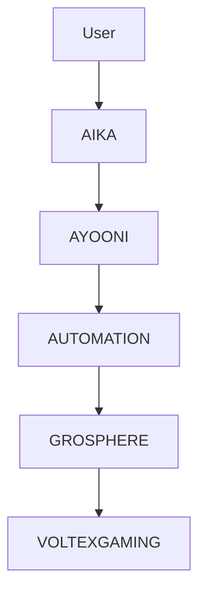

# ASGARDIA AI ECOSYSTEM

Builder: David Carmel Alex

Asgardia is an AI-driven infrastructure system designed to power conversational AI, automation, and digital platforms.

## Architecture

AIKA -> Human Interaction Layer  
AYOONI -> Cognitive AI Brain  
AUTOMATION -> Execution Engine  
GROSPHERE -> Platform Infrastructure  
VOLTEXGAMING -> Product Ecosystem

## Core Repositories

| Layer | Repository | Description |
|------|------|------|
| Automation | [automation](https://github.com/Davidcarmelalex/automation) | execution agents and skills |
| AI Brain | [ayooni](https://github.com/Davidcarmelalex/ayooni) | reasoning and orchestration |
| Platform | [grossphere](https://github.com/Davidcarmelalex/grossphere) | platform infrastructure |
| Product | [voltexgaming](https://github.com/Davidcarmelalex/voltexgaming) | gaming ecosystem |

## Communication Layer

AIKA supports interaction through:

- WhatsApp
- Telegram
- Voice AI
- Web Chat

## AI Models

- Llama3
- Mistral
- Qwen coder
- Phi

## Ecosystem Map

## Vision

Build a distributed AI operating system that integrates human communication, automation, and digital ecosystems.

## Master Architecture

- [Asgardia Master Architecture](./docs/ASGARDIA_MASTER_ARCHITECTURE.md)
