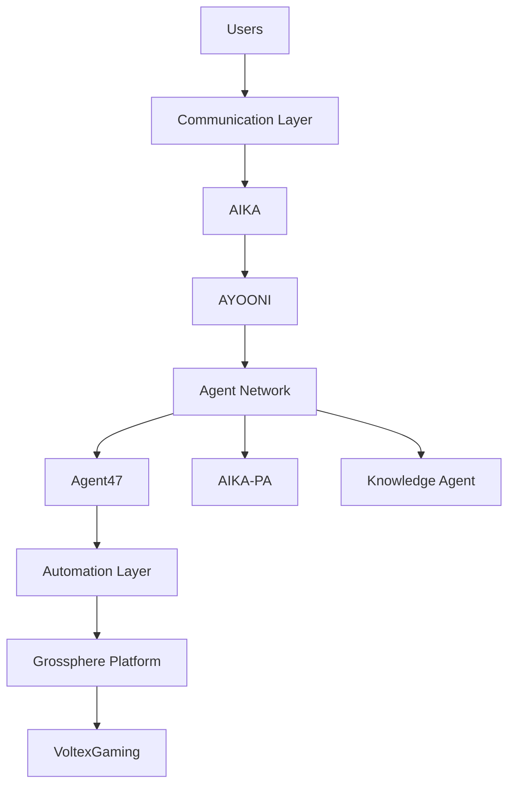

# ASGARDIA MASTER BRAIN (Clean Version)

## Stack

ASGARDIA
- HUMAN INTERFACE
- COMMUNICATION NETWORK
- AIKA (Conversation Engine)
- AYOONI (Cognitive Core)
- AGENT NETWORK
- AUTOMATION ENGINE
- GROSPHERE PLATFORM
- VOLTEXGAMING ECOSYSTEM

## 1. Human Interface

Channels:
- WhatsApp
- Telegram
- Phone Calls
- Web Dashboard
- API

All incoming messages route to AIKA.

## 2. AIKA - Conversation Engine

Responsibilities:
- Conversation management
- Voice interaction
- User identity handling
- Context tracking
- Message routing

Flow:
- User -> AIKA -> AYOONI

## 3. AYOONI - Cognitive Core

Responsibilities:
- Reasoning
- Planning
- Task routing
- Agent coordination
- Decision making

Example behavior:
- Decide which agent to use
- Decide what command to execute
- Return structured response

## 4. Agent Network

Agents:
- Agent47
- AIKA-PA
- Skill Planner
- Knowledge Agent
- Monitoring Agent
- DevOps Agent

Examples:
- Agent47 -> infrastructure commands
- AIKA-PA -> personal tasks/reminders
- Monitoring Agent -> system alerts
- DevOps Agent -> deployments

## 5. Automation Layer

Automation contains:
- Skills (`network`, `scraper`, `indexing`, `binary`)
- Workflows
- System operations
- Infrastructure scripts

Handles:
- Servers
- Docker
- APIs
- System automation

## 6. Grossphere Platform

Functions:
- System monitoring
- Agent visualization
- API gateway
- Service control
- Platform management

Dashboard surfaces:
- Active agents
- Tasks
- Alerts
- System metrics
- Conversation logs

## 7. VoltexGaming Ecosystem

VoltexGaming includes:
- Backend
- Game servers
- Integrations
- Services

Powered by:
- Grossphere APIs
- Automation layer
- AYOONI intelligence

## 8. Memory Graph (Neutral)

Persistent knowledge domains:
- Contacts
- Projects
- Services
- System state
- Conversation context
- Tasks

Neutral examples:
- Contact -> phone number
- Service -> docker container
- Project -> repository

## 9. Communication Layer

Components:
- WhatsApp bridge
- Telegram bot
- Voice gateway
- WebSocket API
- External integrations

Everything routes through AIKA.

## 10. Final Architecture

## System Outcome

Asgardia becomes an AI ecosystem capable of:
- Conversational AI
- Voice assistant flows
- Automation control
- Multi-agent collaboration
- Platform orchestration
- Product integration
