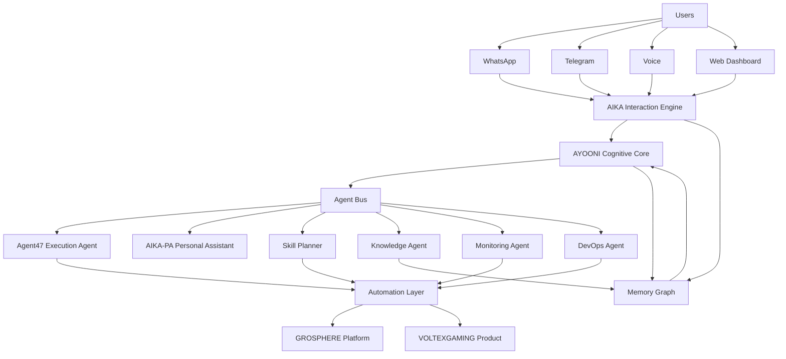

# Asgardia Master Architecture

## Purpose

This document defines the operating architecture for the Asgardia ecosystem and prevents architectural drift across repositories.

## System Layers

1. Human Interface Layer
- AIKA conversation interface
- WhatsApp, Telegram, Voice, Web Dashboard

2. Cognitive Layer
- AYOONI planning, reasoning, routing, orchestration

3. Agent Network Layer
- Agent47 (execution)
- AIKA-PA (personal assistant)
- Skill Planner (capability routing)
- Knowledge Agent (memory/search)
- Monitoring Agent (alerts)
- DevOps Agent (deployments)

4. Automation Layer
- Infrastructure scripts
- Container/runtime control
- Integrations and workflows

5. Platform Layer
- GROSPHERE dashboard and APIs

6. Product Layer
- VOLTEXGAMING services and applications

## Repository-to-Layer Map

- `automation`: execution engine, agents, skills, ops workflows
- `ayooni`: cognitive core, planning, orchestration, memory
- `grossphere`: platform APIs, dashboard, orchestration surface
- `voltexgaming`: product services and gameplay stack
- `Davidcarmelalex`: profile documentation and architecture overview

## Command Flow

User/Channel -> AIKA -> AYOONI -> Agent Bus -> Specialized Agent -> Automation/Services -> Response

## Asgardia Master Brain Map

## Operational Principles

- Keep AIKA as the only human-facing conversational gateway.
- Keep AYOONI as the only orchestrator.
- Route execution through agent bus; avoid tight agent-to-agent direct coupling.
- Store persistent context in memory graph/state stores.
- Expose platform control through GROSPHERE dashboard and APIs.

## Definition of Done (Platform Level)

- Multi-channel communication (WhatsApp/Telegram/Voice/Web)
- Orchestrated multi-agent execution via bus
- Persistent memory + task state
- Dashboard observability for agent/runtime health
- Automated remediation for monitored failures
